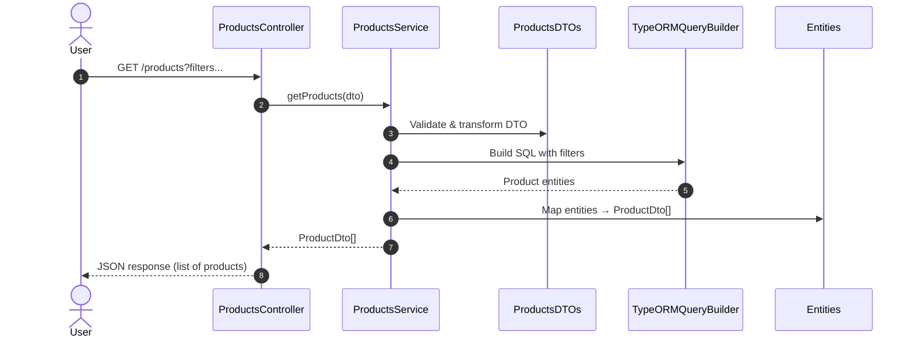
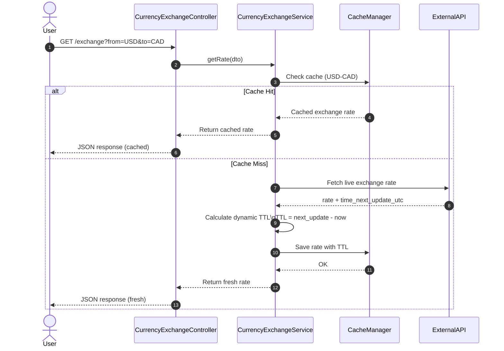

## Setup

- Start a locally running `PostgreSQL` database
- Create a database with name `joinsherpa`
- Copy `.env.example` to `.env` and update the missing information
- Start the `server` with the following command: `npx nx run server:serve`
- Seed the database if not done. To seed it run: `npx nx run server:seed`
- Now you can try out the APIs present in the [postman collection](https://github.com/user-attachments/files/23554973/SherpaChallenge.postman_collection.json)
- To run the unit tests run: `npx nx run server:test`

#### Assumptions

- I copied the data `csv` file to `assets/` folder and renamed the column names to match the defined DTOs.
- Have a locally running `PostgreSQL` database.
- Created a seed script to populate the database.
- Added `seed` target in `project.json` in `server`.


## Architecture

### Products API



### Currency Exchange API



## Key Decision and Takeaways

- I chose `TypeORM` for simplicity and extensive native support. Also `TypeORM` supports both `ActiveRecord` and `Data Mapper` patterns.
    - While `ActiveRecord` is easier to implement, other patterns like data mapper and unit of work (`MikroORM`) is safer and scales better.
    - `MikroORM` is faster and an evolving ORM, but the learning curve is a bit steep. So for this challenge I chose `TypeORM`.

- To apply filters in the `getProducts` endpoint, I used the Query Builder.
    - Alternatively, I could have extended the Repository API, but the query builder pattern is quick and keeps the logic clean.

- Validations:
    - Used `ValidationPipe` to validate `@Body`, `@Params` and `@Query`.
    - Since I used the DTO pattern, I used `class-validator` package. This package gives some very powerful out of the box decorators which can be directly used in the class attributes.
    - Writing custom validation decorator is also straightforward. I created a custom `@IsMinMax(arg)` decorator, which is used to check if both min and max are present, `min` < `max`.

- Choice of datatype in DB for Price:
    - This was an interesting research. There are various ways to store it, `string`,`float`, etc.
    - There also is a `money` type in PostgreSQL but that has it has it's drawbacks. One being it is heavily dependent on currency locale. 
    - A smart way to store can be by converting the amount to it's lowest denomination. For example, `$11.25` can be represented as `1125` cents. This is how Stripe stores it. I didn't use it because I felt like it is an overkill for this usecase.
    - Hence, I decided to chose `Decimal` type.

- Caching:
    - I used in memory NextJS caching. 
    - I used the `Exchange API` to get the exchange rates. It provides 2 URLs. The first being the standard one which just returns the exchange rates. The second is pair, _i.e._, send `from` and `to` currency with the amount and it would return the converted value.
    - One interesting thing I observed with the API is that, the exchange rates are updated on a daily basis and not evry minute or every sec. Hence, I used this information to set dynamic TTL for our cache.
    - The cache object is simple. It uses the response from the standard API and stores it as follows:
    ```json
    {
        "fromCurrency (USD)":{
            "USD":1,
            "CAD":0.8,
            ...
        }
    }
    ```
    - It also calculates the time remaining till these exchange rates expire. Based on this, it sets the TTL for a cache object.

- Logging:
    - I used the `winston` package to manage logging. It is was is recommended in the official NestJS documentaion.
    - It is straightforward to use and provied utilities like prettier, timestamp and various formats.
    - I chose `json` format because it is easier to store and search. 
    - It also provides easier way to dump the logs in log files.

- Error Handling and Filters
    - I wrote custom error handlers for service layers in both modules.
    - AN intersting thing I learned is the global filter. We can map custom errors to specific HTTP responses.

## Some thoughts on scaling this project

### Database
- Data Mapper with custom repositories. This scales better than ActiveRecord because `ActiveRecord` becomes hard to maintain.
- Dedicated caching layer for heavy reads.
- Indexing columns in the Database.
- Sharding/Partitioning
- Connection Pooling
- Add subscribers to listen to Entity changes

### Caching
- Apart for caching heavy DB read queries, for external API we can have distributed caching.
    - L1 In-Memory
    - L2 Redis
- For the specific external API, we can have a background job to refresh the cache after expiry. 
- If the coversion rates change on a daily basis, we can even use DB to store them.

### Request - Response
- Have API gateway and load balancer like Nginx
- Event driven architecture. As the code grows, we can follow a modular monolith and use streaming platforms like `Apache Kafka`.
- For external requests, we can implement rotational API keys and use a message queue like `RabbitMQ` to queue up requests if the request intervals are too often.

### Misc.

- More granular logs and have something like ElasticSearch to store and search the logs. Also move logging to async so that it doesn't block the main thread.
- More granular error handling so that we can triage and fix bugs quickly. 
- Use of background workers for compute heavy tasks.

## If given more time...

- For now, the currency exchange is a standalone API. I was thinking of importing the module in products and have _currency agnostic_ filtering.
- Implement natural language search (ambitious goal).
- I would have implemented exponential backoff for extern API requests.
- Also implement retryable errors for external API calls.
- Maybe have the database running in `Docker`.
